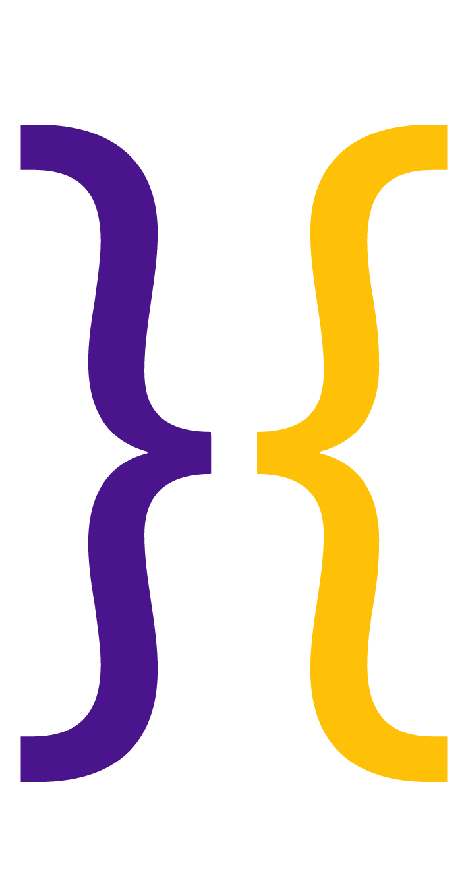

## Bowyer - Alpha
#### App Scaffolding for laravel lumen and angular based projects:
Bowyer use Laravel's micro framework lumen as a base and build an amazing UI on top of it which provide you quick and easy way to jump start your app.
Best part of bowyer is, it comes with 2 different UI: one for landing page and other for dashboard from same CSS and JS vendor files but different config files. This gives you flexibility to have different look on Customer facing vs admin dashboard.

------------------
### Technology stack
- [Lumen] (http://lumen.laravel.com)
- [AngularJS] (https://angularjs.org/)
- [Twitter Bootstrap] (http://getbootstrap.com/)
- [Gulp] (http://gulpjs.com/)
- [Node.js] (https://nodejs.org/en/)

------------------
### Jump Start your app today...
Prerequisites:
- php 5 or above
- node.js 4 or above
- composer

Steps to get started:
- git clone git@github.com:colorgap/bowyer.git
- composer install && npm install
- gulp

if above command doesn't work the try adding sudo
- sudo composer install && npm install
- gulp

Now change the name of your .env.example file to .env

------------------
#### Database setup steps
For database tables and seeding we have created 2 tables Users and Roles, to create table in your database, execute below commands

Set your db details in .env file and execute from project root folder
- php artisan migrate
- php artisan db:seed

------------------
To run locally for making changes and develop your app use below command from root folder
- php -S localhost:8000 -t public

After these steps go to : http://localhost:8000 or point MAMP, XAMP or WAMP servers to bowyer/public directory

You should see Bowyer landing page

Open an another CLI and execute below command to keep your js and css files in sync.
- gulp watch

------------------
To bundle and ship bowyer just execute below gulp command from root folder:
- NODE_ENV=prod gulp build

This will create a bowyer-app.zip in target folder. Just place the zip in your server and explode.

### Quick links
- [Demo](http://bowyer.colorgap.com/)

### User Details:
- admin login: userId: admin@colorgap.com / password: admin
- user login: userId: user@colorgap.com / password: user

---------------
#### Note: Use "gulp watch" while in development node
